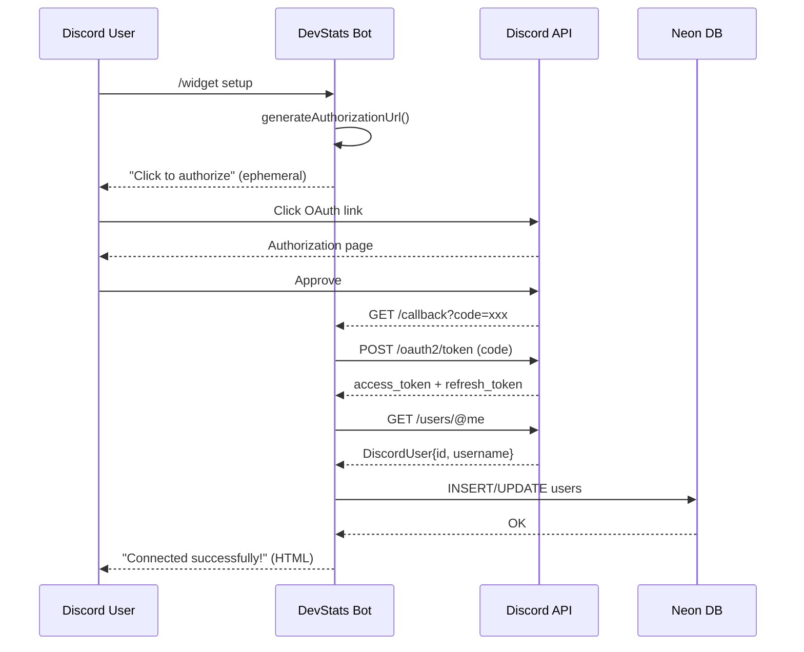
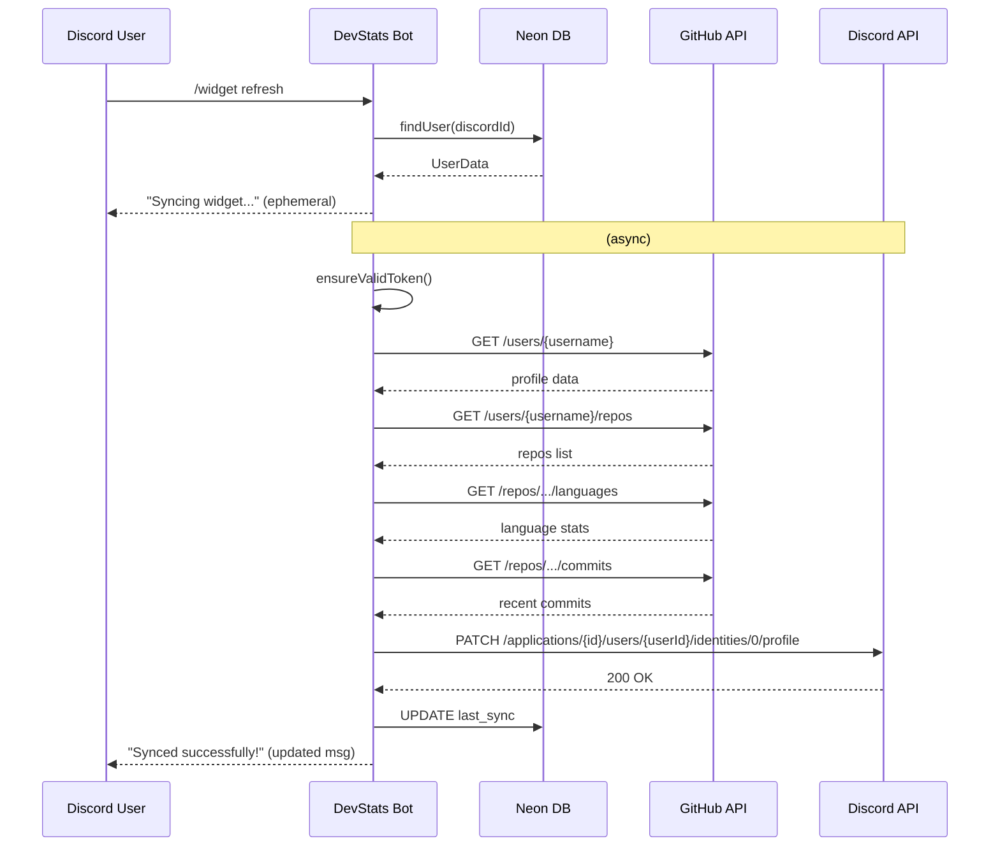
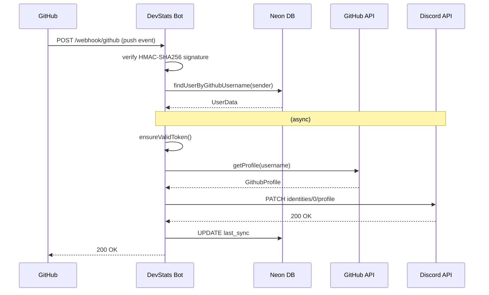
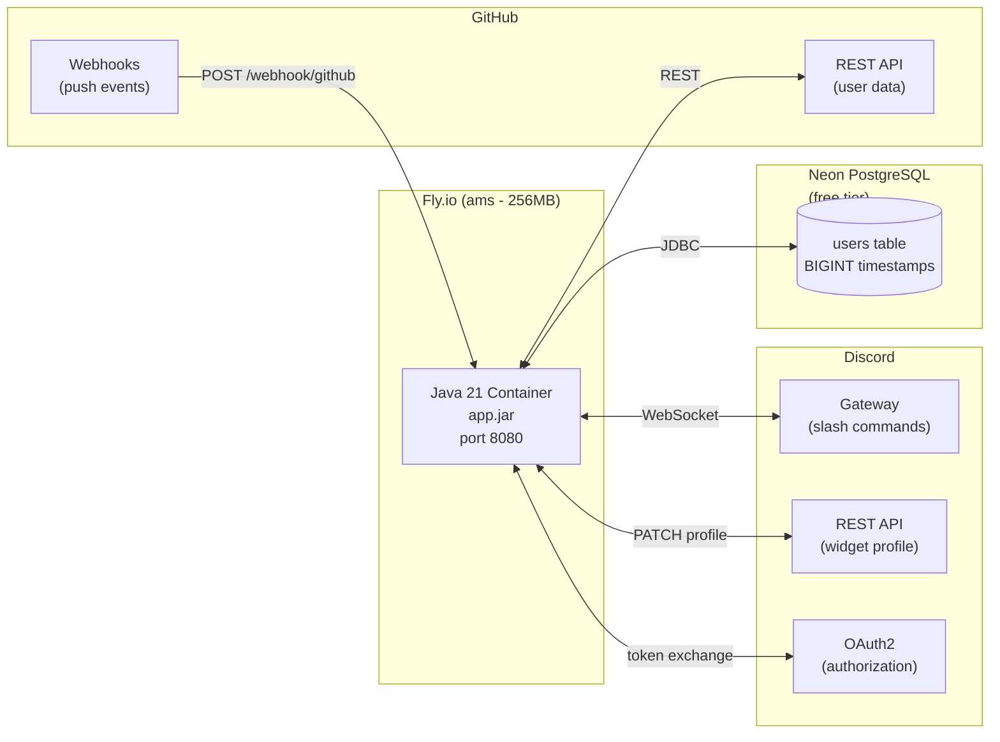

# DevStats - Architecture

## Class Dependency Graph

```mermaid
graph TD
    Main["Main.java<br/><i>Entry Point</i>"]
    
    subgraph Commands
        WidgetCommand["WidgetCommand<br/><i>/router</i>"]
        WidgetSetupCmd["WidgetSetupCommand<br/><i>/setup</i>"]
        WidgetGithubCmd["WidgetGithubCommand<br/><i>/github</i>"]
        WidgetRefreshCmd["WidgetRefreshCommand<br/><i>/refresh</i>"]
    end
    
    subgraph HTTP
        OAuthServer["OAuthServer<br/><i>:8080</i>"]
        OAuthCallback["OAuthCallbackHandler<br/><i>/callback</i>"]
        WebhookServer["WebhookServer<br/><i>:8080</i>"]
        WebhookHandler["WebhookHandler<br/><i>/webhook/github</i>"]
    end
    
    subgraph Services
        DatabaseService["DatabaseService<br/><i>Liquibase + CRUD</i>"]
        OAuthService["OAuthService<br/><i>Discord OAuth2</i>"]
        GithubService["GithubService<br/><i>GitHub REST API</i>"]
        WidgetSyncService["WidgetSyncService<br/><i>Orchestrator</i>"]
        DiscordWidgetSvc["DiscordWidgetService<br/><i>Widget v2 API</i>"]
        AutoSyncService["AutoSyncService<br/><i>Periodic 1min</i>"]
    end
    
    subgraph Models
        Config["Config<br/><i>Static config</i>"]
        UserData["UserData<br/><i>DB Entity</i>"]
        GithubProfile["GithubProfile<br/><i>DTO</i>"]
        WidgetPayload["WidgetPayload"]
        WidgetData["WidgetData"]
        DynamicField["DynamicField<br/><i>type 1=text</i>"]
        ImageField["ImageField<br/><i>type 3=image</i>"]
        DiscordUser["DiscordUser"]
        DiscordToken["DiscordTokenResponse"]
    end
    
    subgraph Utils
        HttpUtils["HttpUtils<br/><i>GET/POST/PATCH</i>"]
        JsonUtils["JsonUtils<br/><i>Jackson</i>"]
        DateUtils["DateUtils"]
    end
    
    subgraph External
        DiscordAPI["Discord API v10"]
        GitHubAPI["GitHub REST API"]
        NeonDB[("Neon PostgreSQL")]
        JDA["JDA WebSocket"]
    end
    
    Main --> Config
    Main --> DatabaseService
    Main --> OAuthService
    Main --> GithubService
    Main --> DiscordWidgetSvc
    Main --> WidgetSyncService
    Main --> WidgetCommand
    Main --> OAuthServer
    Main --> WebhookServer
    Main --> AutoSyncService
    Main --> JDA
    
    WidgetCommand --> WidgetSetupCmd
    WidgetCommand --> WidgetGithubCmd
    WidgetCommand --> WidgetRefreshCmd
    
    WidgetSetupCmd --> OAuthService
    WidgetGithubCmd --> DatabaseService
    WidgetRefreshCmd --> WidgetSyncService
    WidgetRefreshCmd --> DatabaseService
    WidgetRefreshCmd --> OAuthService
    
    OAuthServer --> OAuthCallback
    OAuthCallback --> OAuthService
    OAuthCallback --> DatabaseService
    WebhookServer --> WebhookHandler
    WebhookHandler --> WidgetSyncService
    WebhookHandler --> DatabaseService
    WebhookHandler --> OAuthService
    
    WidgetSyncService --> GithubService
    WidgetSyncService --> DiscordWidgetSvc
    
    AutoSyncService --> WidgetSyncService
    AutoSyncService --> DatabaseService
    AutoSyncService --> OAuthService
    
    DiscordWidgetSvc --> WidgetPayload
    WidgetPayload --> WidgetData
    WidgetData --> DynamicField
    DynamicField --> ImageField
    DiscordWidgetSvc --> GithubProfile
    DiscordWidgetSvc --> Config
    DiscordWidgetSvc --> HttpUtils
    
    OAuthService --> DiscordToken
    OAuthService --> DiscordUser
    OAuthService --> HttpUtils
    OAuthService --> Config
    
    GithubService --> GithubProfile
    GithubService --> DateUtils
    GithubService --> HttpUtils
    GithubService --> JsonUtils
    GithubService --> Config
    
    DatabaseService --> UserData
    DatabaseService --> Config
    
    HttpUtils --> JsonUtils
    
    DiscordWidgetSvc -.->|"PATCH /identities/0/profile"| DiscordAPI
    GithubService -.->|"GET /users, /repos, /commits"| GitHubAPI
    DatabaseService -.->|"JDBC"| NeonDB
    JDA -.->|"WebSocket"| DiscordAPI
```

## Request Flow: /widget setup

```mermaid
sequenceDiagram
    participant User as Discord User
    participant Bot as DevStats Bot
    participant Discord as Discord API
    participant Neon as Neon DB

    User->>Bot: /widget setup
    Bot->>Bot: generateAuthorizationUrl()
    Bot-->>User: "Click to authorize" (ephemeral)
    
    User->>Discord: Click OAuth link
    Discord-->>User: Authorization page
    User->>Discord: Approve
    Discord-->>Bot: GET /callback?code=xxx
    
    Bot->>Discord: POST /oauth2/token (code)
    Discord-->>Bot: access_token + refresh_token
    Bot->>Discord: GET /users/@me
    Discord-->>Bot: DiscordUser{id, username}
    Bot->>Neon: INSERT/UPDATE users
    Neon-->>Bot: OK
    Bot-->>User: "Connected successfully!" (HTML)
```

## Request Flow: /widget refresh

```mermaid
sequenceDiagram
    participant User as Discord User
    participant Bot as DevStats Bot
    participant Neon as Neon DB
    participant GitHub as GitHub API
    participant Discord as Discord API

    User->>Bot: /widget refresh
    Bot->>Neon: findUser(discordId)
    Neon-->>Bot: UserData
    Bot-->>User: "Syncing widget..." (ephemeral)
    
    Note over Bot,Discord: (async)
    Bot->>Bot: ensureValidToken()
    Bot->>GitHub: GET /users/{username}
    GitHub-->>Bot: profile data
    Bot->>GitHub: GET /users/{username}/repos
    GitHub-->>Bot: repos list
    Bot->>GitHub: GET /repos/.../languages
    GitHub-->>Bot: language stats
    Bot->>GitHub: GET /repos/.../commits
    GitHub-->>Bot: recent commits
    
    Bot->>Discord: PATCH /applications/{id}/users/{userId}/identities/0/profile
    Discord-->>Bot: 200 OK
    Bot->>Neon: UPDATE last_sync
    Bot-->>User: "Synced successfully!" (updated msg)
```

## Request Flow: GitHub Webhook

```mermaid
sequenceDiagram
    participant GitHub as GitHub
    participant Bot as DevStats Bot
    participant Neon as Neon DB
    participant API as GitHub API
    participant Discord as Discord API

    GitHub->>Bot: POST /webhook/github (push event)
    Bot->>Bot: verify HMAC-SHA256 signature
    Bot->>Neon: findUserByGithubUsername(sender)
    Neon-->>Bot: UserData
    
    Note over Bot,Discord: (async)
    Bot->>Bot: ensureValidToken()
    Bot->>API: getProfile(username)
    API-->>Bot: GithubProfile
    Bot->>Discord: PATCH identities/0/profile
    Discord-->>Bot: 200 OK
    Bot->>Neon: UPDATE last_sync
    Bot-->>GitHub: 200 OK
```

## Infrastructure

```mermaid
graph LR
    subgraph Fly.io ["Fly.io (ams - 256MB)"]
        Container["Java 21 Container<br/>app.jar<br/>port 8080"]
    end
    
    subgraph Discord
        Gateway["Gateway<br/>(slash commands)"]
        REST["REST API<br/>(widget profile)"]
        OAuth2["OAuth2<br/>(authorization)"]
    end
    
    subgraph Neon ["Neon PostgreSQL<br/>(free tier)"]
        DB[("users table<br/>BIGINT timestamps")]
    end
    
    subgraph GitHub
        REST2["REST API<br/>(user data)"]
        WH["Webhooks<br/>(push events)"]
    end
    
    Container <-->|"WebSocket"| Gateway
    Container <-->|"PATCH profile"| REST
    Container <-->|"token exchange"| OAuth2
    Container <-->|"JDBC"| DB
    Container <-->|"REST"| REST2
    WH -->|"POST /webhook/github"| Container
```
