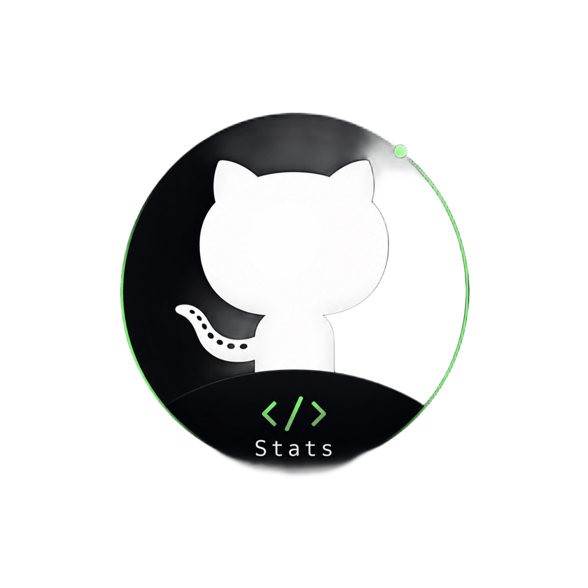
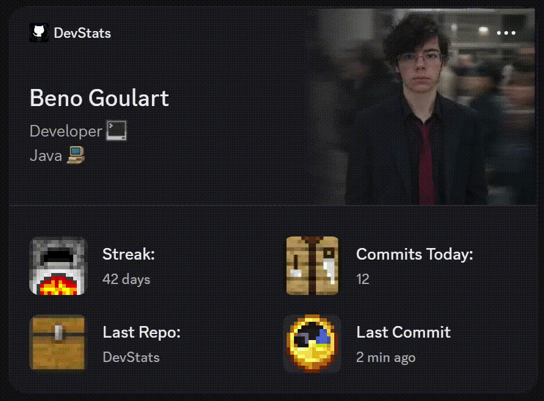
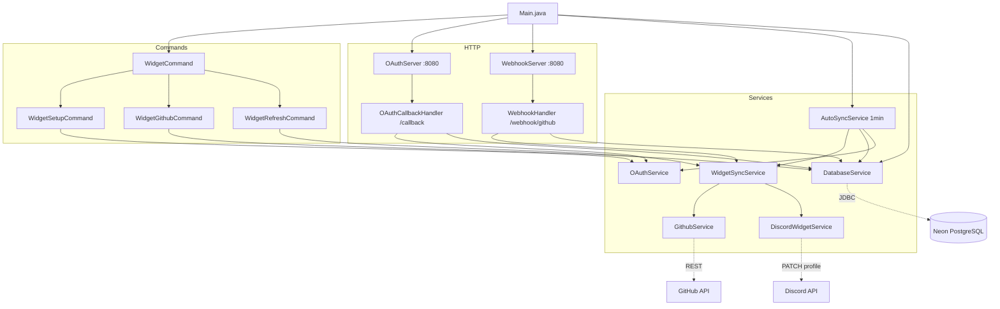
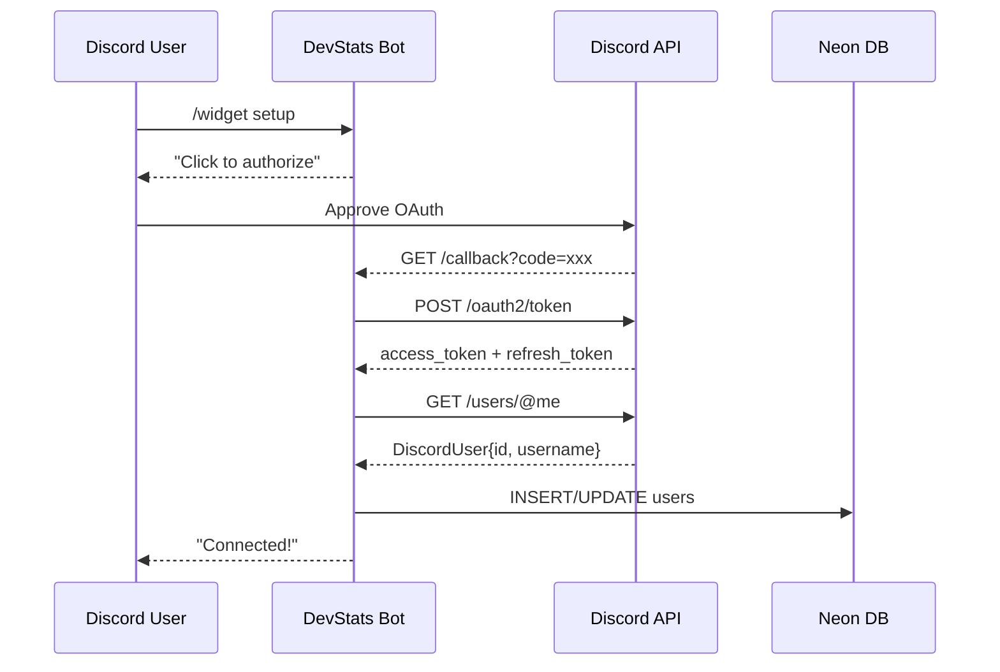
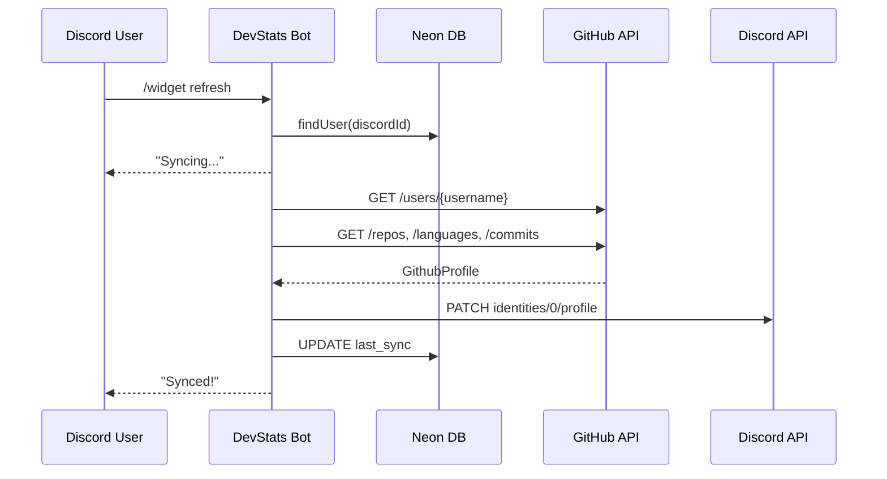
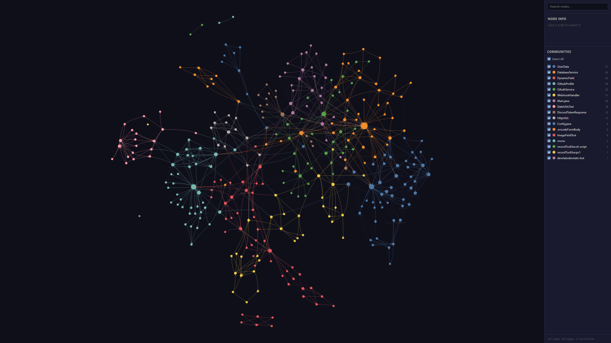

<p align="center">
  
</p>

<p align="center">
  <strong>Your GitHub activity, live on your Discord profile.</strong>
</p>

<p align="center">
  <a href="https://github.com/Beno-Goulart/DevStats/stargazers"></a>
  <a href="https://github.com/Beno-Goulart/DevStats/blob/main/LICENSE"></a>
  <a href="https://github.com/Beno-Goulart/DevStats/commits/main"></a>
  
  
</p>

<p align="center">
  <a href="#preview">Preview</a> ·
  <a href="#features">Features</a> ·
  <a href="#quick-start">Quick Start</a> ·
  <a href="#commands">Commands</a> ·
  <a href="#architecture">Architecture</a> ·
  <a href="#deploy">Deploy</a> ·
  <a href="#tech-stack">Tech Stack</a>
</p>

---

DevStats is a Discord bot that displays your **real-time GitHub activity** directly on your Discord profile using the Discord Social SDK (Widgets v2). It syncs automatically — your profile always reflects what you're actually building.

> **Note:** Discord Widgets v2 are experimental and currently restricted to the application owner's profile only. However, the entire DevStats infrastructure is already built to support multi-user widgets the moment Discord enables widget sharing — making it easy for anyone who wants this widget on their profile. **[Star this repo](https://github.com/Beno-Goulart/DevStats/stargazers)** to stay updated.

## Preview

<p align="center">
  
</p>

## Features

| Feature | Description |
|---|---|
| GitHub Profile | Your avatar and display name from GitHub |
| Bio | Your GitHub bio |
| Primary Language | Most used language across repos |
| Active Repos | Total number of repositories |
| Latest Repository | Most recently updated repo |
| Latest Commit | Last commit message |
| Daily Commits | Commits counter for today |
| Auto-Sync | Widget refreshes every minute in the background |
| Webhook Support | Instant sync on GitHub push events |
| Multi-User | Multiple users can connect their accounts |

## Quick Start

### 1. Invite the Bot

> **[Invite Bot](https://discord.com/oauth2/authorize?client_id=1520821686436630528&permissions=8&integration_type=0&scope=bot+applications.commands)**

### 2. Connect Your GitHub

In any channel where the bot is present:

```
/widget setup
```

Click the button to authorize via OAuth2. Your Discord account is now linked.

### 3. Set Your GitHub Username

```
/widget github <your-username>
```

### 4. Sync Your Widget

```
/widget refresh
```

### 5. Add Widget to Your Profile

Widgets v2 is still experimental — you need to enable it manually via DevTools.

> **Easier alternative:** Use [Widget Identity Creator](https://github.com/chloecinders/widget-identity-creator/releases) — a small open-source desktop app that automates the entire setup. Just paste your bot token and it handles the rest (fetches app data, validates config, applies identity). Much safer than pasting tokens into a website, and no DevTools required.

#### 5a. Enable the experiment (manual)

1. Open Discord in your **browser** (or desktop with DevTools enabled)
2. Press `Ctrl + Shift + I` → **Console** tab
3. Paste and run this snippet to unlock the experiments page:

```js
webpackChunkdiscord_app.push([[Math.random()], {}, (e) => { if(e.b!=undefined){module = Object.values(e.c).find(x => x?.exports?.default?.getUsers && x.exports.default._dispatcher._actionHandlers).exports.default;} }]); nodes = Object.values(module._dispatcher._actionHandlers._dependencyGraph.nodes); try { nodes.find(x => x.name == "ExperimentStore").actionHandler["OVERLAY_INITIALIZE"]({}); } catch (e) { } original = [module.getCurrentUser, module.getNonImpersonatedCurrentUser]; module.getCurrentUser = module.getNonImpersonatedCurrentUser = () => ({ isStaff: () => true }); nodes.find(x => x.name == "DeveloperExperimentStore").actionHandler["OVERLAY_INITIALIZE"]({}); [module.getCurrentUser, module.getNonImpersonatedCurrentUser] = original;
```

4. Go to **Settings → Experiments**
5. Search `2026-03-application-widget-v2-renderer` → set to **Variant 1**

#### 5b. Register the bot in your widget list

In the Discord Console, paste:

```js
let bot_id = "1520821686436630528";
let _mods=webpackChunkdiscord_app.push([[Symbol()],{},e=>e.c]);webpackChunkdiscord_app.pop();
let findByProps=(...e)=>{for(let t of Object.values(_mods))try{if(!t.exports||t.exports===window)continue;if(e.every(e=>t.exports?.[e]))return t.exports;for(let r in t.exports)if(e.every(e=>t.exports?.[r]?.[e])&&"IntlMessagesProxy"!==t.exports[r][Symbol.toStringTag])return t.exports[r]}catch{}};
findByProps("getFeaturedApplicationIds").getFeaturedApplicationIds().push(bot_id);
```

#### 5c. Add the widget

1. Open your Discord profile
2. Click **Edit Profile → Add Widget**
3. Select **DevStats** from the list

After `/widget refresh` (or auto-sync), your profile will show live GitHub stats.

For the full guide, see [chloecinders.com/blog/discord-widgets](https://chloecinders.com/blog/discord-widgets).

#### 5d. Share the Widget — Export / Import

Anyone with their own Discord Application can use the same widget layout. The visual config is exported as a single JSON file in [`widget-config.json`](DevStats-Backend/src/main/resources/widget-config.json).

**Recommended:** Use [Widget Identity Creator](https://github.com/chloecinders/widget-identity-creator/releases) — just paste your bot token and the app applies the widget config automatically.

**Manual import via DevTools:**

1. Go to [Discord Developer Portal](https://discord.com/developers/applications) → your application
2. Open **DevTools** in the Discord client (`Ctrl + Shift + I`)
3. In the Console, paste the contents of `widget-config.json` and run:

```js
// Replace WIDGET_CONFIG with the full JSON from widget-config.json
let WIDGET_CONFIG = { "_type": "discord_widget_config", ... };

let _mods=webpackChunkdiscord_app.push([[Symbol()],{},e=>e.c]);webpackChunkdiscord_app.pop();
let findByProps=(...e)=>{for(let t of Object.values(_mods))try{if(!t.exports||t.exports===window)continue;if(e.every(e=>t.exports?.[e]))return t.exports;for(let r in t.exports)if(e.every(e=>t.exports?.[r]?.[e])&&"IntlMessagesProxy"!==t.exports[r][Symbol.toStringTag])return t.exports[r]}catch{}};
findByProps("updateDeveloperSettingsApplication").updateDeveloperSettingsApplication("YOUR_APP_ID", {widgetConfig: WIDGET_CONFIG});
```

4. Replace `YOUR_APP_ID` with your application's ID
5. The widget layout (icons, data bindings, surfaces) will be applied to your app

## Widget JSON Structure

The widget payload sent to Discord follows this structure:

```json
{
  "data": {
    "dynamic": [
      { "type": 1, "name": "full_name",      "value": "Beno Goulart" },
      { "type": 1, "name": "bio",            "value": "Code-> Commit-> Repeat" },
      { "type": 3, "name": "profile_img",    "value": { "url": "https://avatars.githubusercontent.com/u/135740382?v=4" } },
      { "type": 3, "name": "role_img",       "value": { "url": "<URL to role_img.png>" } },
      { "type": 1, "name": "language",       "value": "Java" },
      { "type": 3, "name": "java",           "value": { "url": "<URL to java.png>" } },
      { "type": 1, "name": "active",         "value": "4" },
      { "type": 1, "name": "commits_today",  "value": "12" },
      { "type": 1, "name": "last_commit",    "value": "2 min ago" },
      { "type": 1, "name": "last_repo",      "value": "DevStats" },
      { "type": 3, "name": "language_icon",  "value": { "url": "<URL to language_icon.png>" } }
    ]
  }
}
```

| Type | Description |
|---|---|
| `1` | Text field — `value` is a string |
| `2` | Number field — `value` is an integer |
| `3` | Image field — `value` is an object with a `url` key |

Field names (`name`) must match the Data Field values configured in the Discord Widget Editor for your application.

## Commands

| Command | Description |
|---|---|
| `/widget setup` | Start the OAuth2 flow to connect your Discord account |
| `/widget github <username>` | Set your GitHub username |
| `/widget refresh` | Manually sync your widget with the latest GitHub data |
| `/widget unlink` | Remove your identity and unlink your account |

## Architecture



### OAuth Flow



### Sync Flow



See [ARCHITECTURE.md](./ARCHITECTURE.md) for full diagrams.

### Knowledge Graph (Graphify)

<p align="center">
  
</p>

<p align="center"><em>341 nodes · 807 edges · 17 communities — top 60 most connected classes</em></p>

| God Node | Edges | Role |
|---|---|---|
| `DatabaseService` | 42 | DB access hub |
| `GithubProfile` | 28 | GitHub data DTO |
| `UserData` | 27 | DB entity |
| `OAuthService` | 23 | Discord OAuth2 |
| `WidgetSyncService` | 18 | Orchestrator |
| `GithubService` | 16 | GitHub API client |

Open [graphify-out/graph.html](https://beno-goulart.github.io/DevStats/graphify-out/graph.html) for the **interactive version** — click nodes, filter by community.

## Deploy

### Fly.io (Production)

```bash
# Install flyctl
curl -L https://fly.io/install.sh | sh

# Launch
flyctl launch

# Set environment variables
flyctl secrets set DISCORD_BOT_TOKEN=your_token
flyctl secrets set DISCORD_APPLICATION_ID=your_app_id
flyctl secrets set DISCORD_CLIENT_SECRET=your_secret
flyctl secrets set DATABASE_URL=your_neon_connection_string
flyctl secrets set OAUTH_REDIRECT_URI=https://your-app.fly.dev/callback

# Deploy
flyctl deploy
```

### Local Development

```bash
# Clone
git clone https://github.com/Beno-Goulart/DevStats.git
cd DevStats

# Create .env file (see .env.example)
cp DevStats-Backend/.env.example DevStats-Backend/.env

# Build and run
cd DevStats-Backend
mvn clean package -DskipTests
java -jar target/devstats-bot-1.0.0.jar
```

The bot uses SQLite locally when `DATABASE_URL` is not set.

## Tech Stack

| Component | Technology |
|---|---|
| Language | Java 21 |
| Discord Bot | [JDA](https://github.com/DV8FromTheWorld/JDA) 5.6.1 |
| HTTP Server | `com.sun.net.httpserver` (shared port 8080) |
| Database | PostgreSQL via [Neon](https://neon.tech) (prod) / SQLite (local) |
| Migrations | [Liquibase](https://www.liquibase.org) |
| Build | Maven + Shade Plugin (fat JAR) |
| Deployment | [Fly.io](https://fly.io) (Docker) |
| CI | GitHub Actions |

## Project Structure

```
DevStats/
├── DevStats-Backend/
│   └── src/main/java/devstats/
│       ├── Main.java                    # Entry point
│       ├── commands/                    # Slash commands
│       │   ├── WidgetCommand.java       # /router
│       │   ├── WidgetSetupCommand.java  # /setup
│       │   ├── WidgetGithubCommand.java # /github
│       │   └── WidgetRefreshCommand.java # /refresh
│       ├── services/                    # Business logic
│       │   ├── DatabaseService.java     # DB access + migrations
│       │   ├── OAuthService.java        # Discord OAuth2
│       │   ├── GithubService.java       # GitHub REST API
│       │   ├── DiscordWidgetService.java # Widget v2 API
│       │   ├── WidgetSyncService.java   # Orchestrator
│       │   └── AutoSyncService.java     # Background scheduler
│       ├── http/                        # HTTP handlers
│       │   ├── OAuthServer.java         # /callback
│       │   └── WebhookServer.java       # /webhook/github
│       ├── models/                      # Data classes
│       └── utils/                       # HTTP, JSON, Date helpers
├── Dockerfile
├── fly.toml
└── ARCHITECTURE.md
```

## Privacy

DevStats only accesses GitHub data required to generate statistics. OAuth tokens are stored securely in the database and are never shared. No data is sold or used for analytics.

- [Privacy Policy](docs/privacy.html)
- [Terms of Service](docs/terms.html)

## License

[MIT](LICENSE) — use it, fork it, deploy it.
